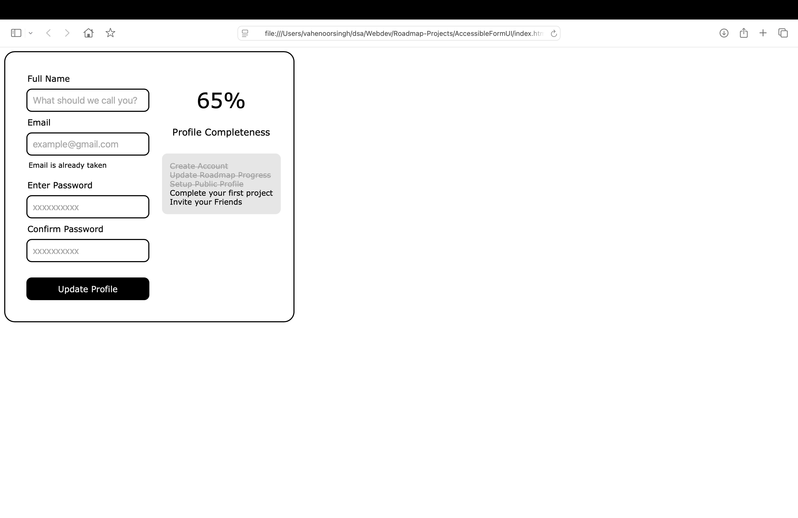

# Accessible Form UI
Created an accessible form UI using HTML and CSS. Inspired from [Roadmap.sh](https://roadmap.sh/projects/accessible-form-ui)
# How to run
- Download or clone project to your desired folder
- Open index.html
# Screenshot 

